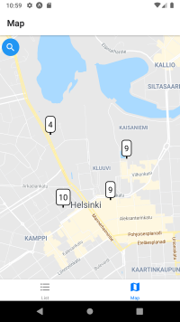
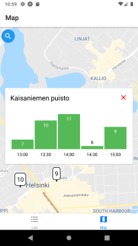
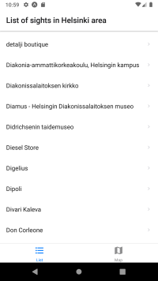

# Team IdeaaVailla - Ohjelmistoprojekti 2
[](https://spring.io/)
[](https://www.bluetooth.com/)

## Table of contents

- [Table of contents](#table-of-contents)
- [About the project](#about-the-project)
- [Built With](#build-with)
- [Getting Started](#)getting-started
  - [Prerequisities](#prerequisities)
  - [Installation](#installation)
- [Dependencies](#dependencies)
  - [Python dependencies](#python-dependencies)
  - [Node dependencies](#node-dependencies)

## About the Project

The main motive for this project was to create a solution to fulfill the need to keep track of people located in different areas in Helsinki. We got this idea from an outside source which was a sort of partner during this Ohjelmistoprojekti 2 -course. They presented us a few ideas and thoughts and among them was a thought of keeping track of the traveller flows in Helsinki. This need of getting data about people present in different locations seemed to be a good fit for this course and that's why we ended up sticking with it. 

We bounced around a couple of ideas on how to build the solution. Eventually we decided to go with Bluetooth technology because it seemed to be the best way to get data on how many people approximately are in a specific location. 

To get the amount of devices sending Bluetooth data we used Raspberry Pi 3. It collects data of nearby devices that are using Bluetooth and then sends this data to the back-end. 

We set up REST API to provide a straightforward way to access the collected data.

We also built a simple mobile application - mainly to demonstrate how we had thought to use the collected data.  


&nbsp;&nbsp;&nbsp;&nbsp;

&nbsp;&nbsp;&nbsp;&nbsp;


## Built With

* Python
* Spring Boot
* React Native

## Getting Started
  

### Prerequisites

Front end/Mobile app

* npm
  ```bash
  npm install -g npm@latest
  ```
* expo
  ```bash
  npm install -g expo-cli
  ```
* node.js
  ```bash
  download the latest LTS version: https://nodejs.org/en/download/
  ```

### Installation

1. Clone the repo
  ```bash
  git clone https://github.com/lennikorhonen/OhjelmistoProjekti2.git
  ```

2. Navigate to bt-scanner-app directory
  ```bash
  cd Ohjelmistoprojekti2/bt-scanner-app/
  ```

3. Install packages
  ```bash
  npm install
  ```
  
4. Start fake REST API
  ```bash
  npm run server
  ```

5. In another terminal, with Android emulator up and running, start Metro Bundler
  ```bash
  npm run android
  ```

### Python dependencies

    sudo apt install python-dev
    sudo apt install libbluetooth-dev
    pip3 install pybluez
    pip3 install schedule
    pip3 install ipinfo

### Getting started with backend
Clone project from github
```
https://github.com/lennikorhonen/OhjelmistoProjekti2
```
Import application as Maven Project in IDE
To run application locally:
Go to Application class and run as Java application
```
/OhjelmistoProjekti2/RaspberryServer/src/main/java/Ohjelmistoprojekti2/raspberryServer RaspberryServerAppliction.java
```

### Backend documentation
This application is written in Java programming language. In order to run this project you need Java version 8 or newer installed.


### Backend endpoints
Fetching events for Admin panel
```
raspberrybackend.herokuapp.com/raspberrylist
```
Getting all /api endpoints
```
raspberrybackend.herokuapp.com/api
```
For fetching every existing raspberry pi from database
```
raspberrybackend.herokuapp.com/api/raspberries
```
For fetching all the results
```
raspberrybackend.herokuapp.com/api/results
```
## Roadmap

As of 10.12.2020, project development is halted and further support is discontinued.

## Contributing

* [@JoonasKulmala](https://github.com/JoonasKulmala)
* [@OttoKorhonen](https://github.com/OttoKorhonen)
* [@LenniKorhonen](https://github.com/lennikorhonen)
* [@AnnikaHaapalahti](https://github.com/rusinainen)
* [@RoopeLaakso](https://github.com/Rohelaa)

## Acknowledgements

Thanks to Helsinki Marketing for presenting us with their API & providing ideas...?

## Licenses

Distributed under the [MIT](https://choosealicense.com/licenses/mit/) license.
